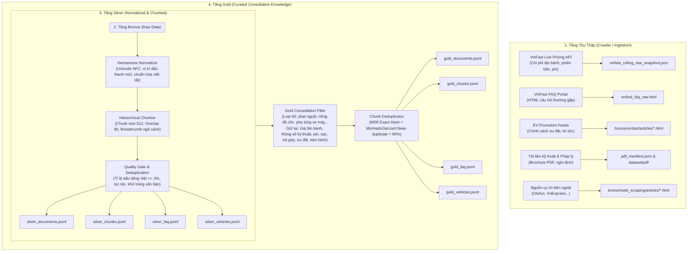

# WeKnora Vietnamese Pre-RAG Data Pipeline

Hệ thống Data Pipeline xử lý dữ liệu tiếng Việt phục vụ hệ thống RAG (Retrieval-Augmented Generation) chuyên sâu trong lĩnh vực tư vấn mua bán ô tô điện VinFast (VF 3, VF 5 Plus, VF 6, VF 7, VF 8, VF 9, EC Van...).

Pipeline được xây dựng theo kiến trúc **Medallion (Bronze -> Silver -> Gold)**, đảm bảo dữ liệu trải qua các tầng chuẩn hóa ngôn ngữ tiếng Việt nghiêm ngặt, chia đoạn theo ngữ cảnh phân cấp (Hierarchical Chunking) và áp dụng bộ lọc nghiệp vụ tư vấn mua xe loại bỏ hoàn toàn các nội dung nhiễu.

---

## 1. Kiến trúc Tổng quan (Medallion Architecture)



---

## 2. Các tầng dữ liệu chi tiết

### 2.1. Tầng Bronze (Dữ liệu thô)

- **Vị trí lưu trữ**: `dataset/bronze/` và `dataset/pdf/`
- **Dữ liệu thành phần**:
  - `vinfast/relational/vinfast_rolling_raw_snapshot.json`: Snapshot API trực tiếp từ hệ thống tính chi phí lăn bánh của VinFast (giá niêm yết, ưu đãi theo tỉnh thành, biểu phí lăn bánh, chính sách pin thuê vs pin kèm xe).
  - `vinfast/faq/vinfast_faq_raw.html`: Toàn bộ cây thư mục câu hỏi thường gặp về sản phẩm, dịch vụ, trạm sạc, hậu mãi.
  - `vinfast/articles/`: Các bài viết chính sách ưu đãi, chương trình "Mãnh liệt tinh thần Việt Nam", voucher, thu cũ đổi mới.
  - `web_scraping/articles/`: Các bài đánh giá, trải nghiệm thực tế xe điện từ các diễn đàn và trang tin xe hơi uy tín tại Việt Nam.
  - `pdf/`: Các file brochure thông số kỹ thuật chính hãng và tài liệu chính sách, biểu phí đăng ký/trước bạ xe điện.
  - `sources.csv`: Danh mục URL hạt giống và nguồn tin đã qua kiểm duyệt phân loại xe ô tô điện (chặn triệt để xe máy điện 2 bánh như Feliz, Evo, Klara, Vento, Theon...).

### 2.2. Tầng Silver (Chuẩn hóa & Chia đoạn)

- **Vị trí lưu trữ**: `dataset/silver/`
- **Các bộ xử lý cốt lõi**:
  - **Vietnamese Normalizer**:
    - Chuẩn hóa Unicode về chuẩn dựng sẵn (NFC).
    - Chuẩn hóa cách đặt dấu thanh tiếng Việt theo quy tắc mới của Bộ Giáo dục (ví dụ: `hòa` thay vì `hoà`, `thúy` thay vì `thuý`).
    - Chuẩn hóa các ký tự đặc biệt, dấu ngoặc kép, gạch ngang, ký hiệu tiền tệ (`VNĐ`, `đ`), đơn vị đo (`km/h`, `kWh`, `kW`, `mm`, `Nm`).
  - **Sentence Splitter**: Phân tách câu tiếng Việt nhận biết các từ viết tắt thông dụng (`Tp.`, `Q.`, `P.`, `NĐ`, `QĐ`, `TT`, `TS`, `ThS`, `PGS`) và số thập phân nhằm không ngắt câu sai lệch ngữ nghĩa.
  - **Extractors**:
    - `RelationalExtractor`: Bóc tách dữ liệu có cấu trúc từ snapshot API thành danh mục xe (`SilverVehicle`) với đầy đủ bảng giá chi tiết theo từng địa phương.
    - `FAQExtractor`: Tách các cặp hỏi - đáp theo nhóm danh mục, chuyển đổi định dạng HTML sang Markdown sạch với `markdownify`.
    - `HTMLArticleExtractor`: Trích xuất nội dung chính của bài viết, loại bỏ menu, footer, quảng cáo nhờ `trafilatura` và `BeautifulSoup`.
    - `PDFExtractor`: Đọc và phân tầng cấu trúc văn bản PDF bằng `PyMuPDF`, loại bỏ số trang và header/footer in ấn trình duyệt.
  - **Hierarchical Chunker**: Chia tài liệu theo phân cấp cấu trúc (Tài liệu -> Đề mục -> Chunks) với kích thước mặc định 512 ký tự và độ gối 80 ký tự. Mỗi chunk lưu kèm `heading_path` và breadcrumb để giữ toàn vẹn ngữ cảnh khi truy vấn RAG.
  - **Quality Gates**: Lọc bỏ các văn bản có độ dài dưới 50 ký tự hoặc tỉ lệ ký tự có dấu tiếng Việt dưới 3%.

### 2.3. Tầng Gold (Tri thức tư vấn mua xe chất lượng cao)

- **Vị trí lưu trữ**: `dataset/gold/`
- **Các bộ xử lý cốt lõi**:
  - **Gold Consultation Filter**:
    - Loại bỏ triệt để các bài viết và chunk chứa nội dung nhiễu không phục vụ việc ra quyết định mua xe (như quy định xử phạt vi phạm giao thông theo Nghị định 100/168, xử lý nồng độ cồn, sang tên đổi biển, phụ tùng xe 2 bánh).
    - Tập trung giữ lại và phân loại dữ liệu theo 6 nhóm chủ đề tư vấn mua xe trọng tâm:
      1. `thong_so_ky_thuat`: Kích thước, công suất động cơ, dung lượng pin, quãng đường di chuyển (NEDC/WLTP), tính năng ADAS, tiện nghi nội thất.
      2. `gia_ca_lan_banh`: Giá niêm yết, lệ phí trước bạ, phí đăng ký biển số, bảo hiểm, tổng chi phí lăn bánh theo từng tỉnh/thành phố.
      3. `he_thong_tram_sac`: Mạng lưới sạc công cộng, trụ sạc nhanh DC, sạc tại nhà AC, biểu phí sạc điện và chính sách thuê/mua pin.
      4. `tai_chinh_tra_gop`: Lãi suất vay ngân hàng, hạn mức vay, thời gian vay, số tiền trả trước, bảng tính lãi hàng tháng.
      5. `chinh_sach_uu_dai`: Miễn lệ phí trước bạ xe điện theo chính sách Nhà nước, quà tặng VinFast, ưu đãi hội viên, voucher.
      6. `hau_mai_bao_duong`: Thời hạn bảo hành xe (7-10 năm), bảo hành pin, cứu hộ 24/7, chi phí bảo dưỡng định kỳ xe điện.
  - **Chunk Deduplicator**: Khử trùng lặp 2 tầng:
    - *Exact Deduplication*: So sánh băm MD5 văn bản đã chuẩn hóa.
    - *Near-duplicate Deduplication*: So sánh tập n-gram ký tự (Jaccard similarity threshold 0.90) để loại bỏ các đoạn văn bản tương tự nhau (ví dụ: các đoạn khuyến cáo pháp lý hoặc chân trang lặp đi lặp lại giữa các trang).

---

## 3. Cài đặt & Môi trường

### 3.1. Yêu cầu hệ thống

- Python `>= 3.10`
- Hệ điều hành: Windows, macOS, hoặc Linux

### 3.2. Cài đặt thư viện phụ thuộc

Cài đặt toàn bộ các thư viện cần thiết đã được cập nhật trong `requirements.txt`:

```bash
pip install -r requirements.txt
```

Các thư viện chính của Data Pipeline:

- `beautifulsoup4`: Phân tích cú pháp HTML và bóc tách dữ liệu cấu trúc.
- `trafilatura`: Bóc tách nội dung bài viết và loại bỏ boilerplate/rác HTML.
- `markdownify`: Chuyển đổi định dạng HTML câu hỏi thường gặp sang Markdown.
- `pymupdf`: Đọc và phân tầng nội dung từ file tài liệu kỹ thuật PDF.
- `lxml`: Trình phân tích cú pháp HTML/XML hiệu năng cao.

---

## 4. Hướng dẫn sử dụng CLI

CLI của Pipeline được đóng gói dạng module chạy thông qua Python:

### 4.1. Chạy trọn gói End-to-End Pipeline

Chạy toàn bộ quy trình: [Crawl thô] -> Chuẩn hóa Silver -> Lọc & Khử trùng Gold:

```bash
# Chạy toàn bộ bao gồm cả crawl dữ liệu mới nhất
python -m src.pipeline run --crawl

# Chạy Silver -> Gold dựa trên dữ liệu Bronze đã có sẵn
python -m src.pipeline run
```

Các tham số tùy chọn:

- `--crawl`: Thực thi thu thập dữ liệu thô (Bronze) trước khi xử lý.
- `--dynamic-urls`: Kích hoạt tìm kiếm nguồn mở rộng từ các trang tin tức/RSS.
- `--chunk-size`: Kích thước chunk văn bản (mặc định: `512`).
- `--chunk-overlap`: Độ chồng lấn giữa các chunk (mặc định: `80`).
- `-v, --verbose`: Bật log chi tiết phục vụ gỡ lỗi.

### 4.2. Chạy từng bước độc lập

#### Bước 1: Thu thập dữ liệu thô (Crawl -> Bronze)

```bash
# Thu thập tất cả các nguồn (API giá lăn bánh, FAQ, khuyến mãi, PDF, bài viết)
python -m src.pipeline crawl --mode all --discover-urls

# Chỉ thu thập API giá lăn bánh
python -m src.pipeline crawl --mode api

# Chỉ thu thập FAQ VinFast
python -m src.pipeline crawl --mode faq

# Chỉ tải brochure thông số kỹ thuật PDF
python -m src.pipeline crawl --mode pdf
```

#### Bước 2: Chuẩn hóa & Tạo tầng Silver

```bash
python -m src.pipeline silver --chunk-size 512 --chunk-overlap 80
```

#### Bước 3: Lọc nghiệp vụ & Khử trùng tầng Gold

```bash
python -m src.pipeline gold
```

### 4.3. Kiểm tra thống kê & Đọc dữ liệu mẫu

#### Xem báo cáo thống kê:

```bash
# Xem thống kê tầng Gold
python -m src.pipeline stats --stage gold

# Xem thống kê tầng Silver
python -m src.pipeline stats --stage silver
```

#### Xem mẫu dữ liệu (Sample):

```bash
# Xem 3 chunk tri thức Gold đầu tiên
python -m src.pipeline sample --stage gold --type chunks -n 3

# Xem dữ liệu bảng giá & thông số xe (vehicles)
python -m src.pipeline sample --stage gold --type vehicles -n 2

# Xem dữ liệu câu hỏi thường gặp (FAQ)
python -m src.pipeline sample --stage gold --type faq -n 3
```

---

## 5. Cấu trúc Thư mục & Định dạng Dữ liệu

Sau khi pipeline hoàn tất, dữ liệu được tổ chức tại thư mục `dataset/` ở gốc dự án:

```
dataset/
├── sources.csv                       # Danh mục các nguồn thu thập đã phân loại
├── bronze/                           # Tầng dữ liệu thô
│   ├── README.md                     # Báo cáo tự động tổng hợp tầng Bronze
│   └── vinfast/
│       ├── relational/               # Snapshot API chi phí lăn bánh
│       ├── faq/                      # Raw HTML FAQ
│       ├── articles/                 # Raw HTML tin tức & ưu đãi
│       └── vinfast_sources_manifest.json
├── pdf/                              # Tài liệu PDF & Manifest
│   ├── pdf_manifest.json
│   ├── thong_so_ky_thuat/            # Brochure xe PDF chính hãng
│   └── thu_tuc_phap_ly/              # Tài liệu biểu phí, quy định
├── silver/                           # Tầng dữ liệu đã chuẩn hóa
│   ├── silver_documents.jsonl        # Danh sách tài liệu toàn văn
│   ├── silver_chunks.jsonl           # Danh sách các chunk phân đoạn
│   ├── silver_faq.jsonl              # Tập Q&A hỏi đáp đã chuẩn hóa Markdown
│   ├── silver_vehicles.jsonl         # Danh mục xe và biểu giá
│   ├── silver_report.json            # Báo cáo kiểm định chất lượng Silver
│   └── README.md                     # Báo cáo tự động chi tiết tầng Silver
└── gold/                             # Tầng tri thức tinh gọn phục vụ RAG
    ├── gold_documents.jsonl          # Tài liệu đã lọc chuyên sâu tư vấn mua xe
    ├── gold_chunks.jsonl             # Chunks sẵn sàng nhúng (embedding) vào Vector DB
    ├── gold_faq.jsonl                # Bộ hỏi đáp chuẩn phục vụ tra cứu nhanh
    ├── gold_vehicles.jsonl           # Bảng thông số kỹ thuật & giá bán hoàn chỉnh
    ├── gold_report.json              # Báo cáo tỉ lệ giữ lại, phân bố chủ đề
    └── README.md                     # Báo cáo tự động chi tiết tầng Gold
```

### Chi tiết Schema của Gold Chunk (`gold_chunks.jsonl`)

Mỗi bản ghi trong `gold_chunks.jsonl` đại diện cho một vector embedding unit:

```json
{
  "chunk_id": "doc_vf3_specs_ch0001",
  "document_id": "doc_vf3_specs",
  "chunk_index": 1,
  "heading_path": "VinFast VF 3 > Thông số kỹ thuật > Hệ thống pin và sạc",
  "text": "VinFast VF 3 trang bị khối pin dung lượng 18.64 kWh cho quãng đường di chuyển đạt 210 km theo chuẩn NEDC sau một lần sạc đầy. Thời gian sạc pin từ 10% đến 70% là 36 phút với cổng sạc nhanh DC...",
  "token_count": 86,
  "char_count": 248,
  "quality_score": 0.98,
  "category": "thong_so_ky_thuat",
  "domain": "vinfastauto.com",
  "url": "https://vinfastauto.com/vn_vi/dat-coc-xe-dien-vf3",
  "metadata": {
    "vehicle_model": "VF 3",
    "has_pricing": false,
    "battery_capacity_kwh": 18.64
  }
}
```

---

## 6. Kiểm thử tự động (Unit & Integration Tests)

Hệ thống cung cấp bộ kiểm thử toàn diện bằng `pytest`:

```bash
python -m pytest src/pipeline/tests -v
```

Danh mục các bài kiểm thử:

- `test_vietnamese_normalizer.py`: Kiểm tra chuẩn hóa Unicode NFC và vị trí đặt dấu thanh mới tiếng Việt.
- `test_sentence_splitter.py`: Kiểm tra tách câu tiếng Việt không bị ngắt quãng tại chữ viết tắt và số thực.
- `test_hierarchical_chunker.py`: Kiểm tra việc phân đoạn và duy trì liên kết heading breadcrumb.
- `test_chunk_deduplicator.py`: Kiểm tra thuật toán khử trùng lặp chính xác (MD5) và gần đúng (MinHash/Jaccard).
- `test_gold_filter.py`: Kiểm tra cơ chế sàng lọc chủ đề tư vấn mua xe và loại bỏ bài viết pháp luật giao thông rác.
- `test_crawlers.py`: Kiểm tra catalog URL hạt giống và cơ chế crawl.
- `test_pipeline_integration.py`: Kiểm tra tích hợp luồng xử lý dữ liệu từ đầu đến cuối.
